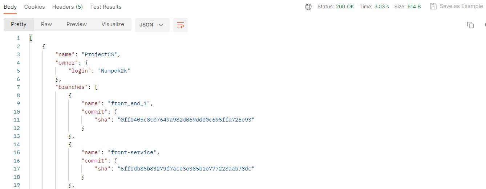
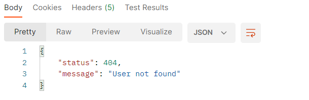
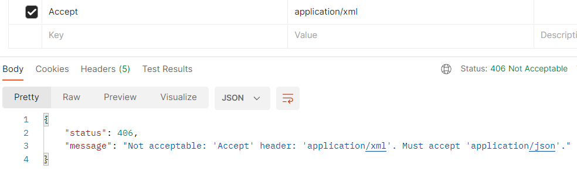

# Atipera Recruitment Task

This project provides possibility to obtain information about user's repositories.
This project was build with Java 17 and SpringBoot 3.1.0
### 

There is only one endpoint available, 
which returns all the information given in requirements:
```
localhost:8080/api/user/{username}/repos
```
As a user or developer you should provide username of 
desire user to return all the information.
#### Example output:


### Exception handling

#### User Not Found (404)


#### Unsupported Media Type (406)

